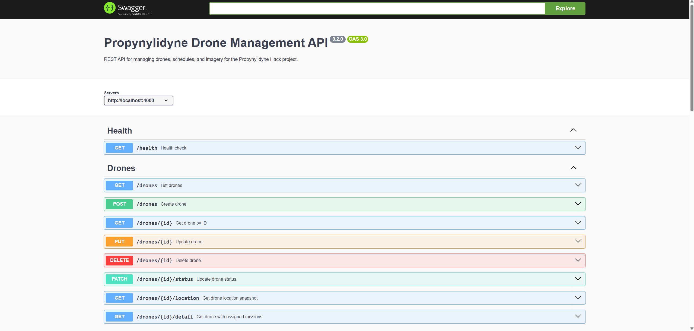

## Possible Commands

`npm run start` or `npm run dev` to run the API docs

`npm run build` to build the app

## Docker

You can also build an image run this in a Docker container, using the following commands:
```
docker build -t backend .
docker run -p 4000:4000 backend
```
Then, open http://localhost:4000/api-docs to view the API docs interface.

